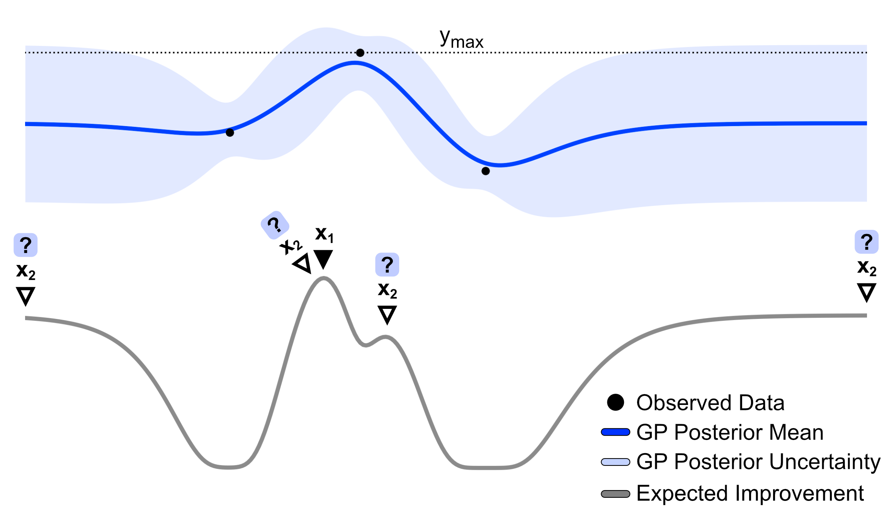
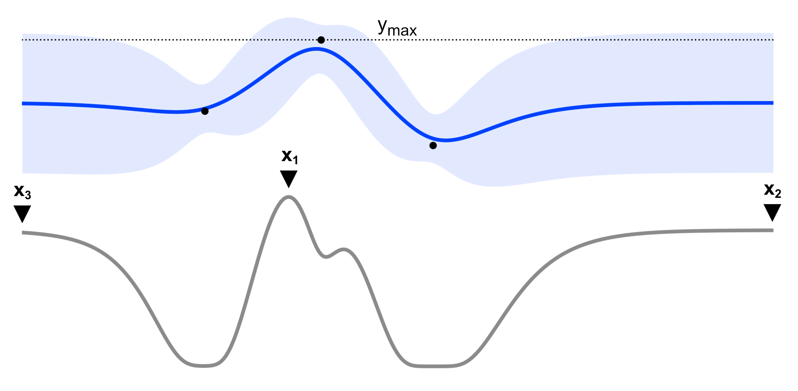
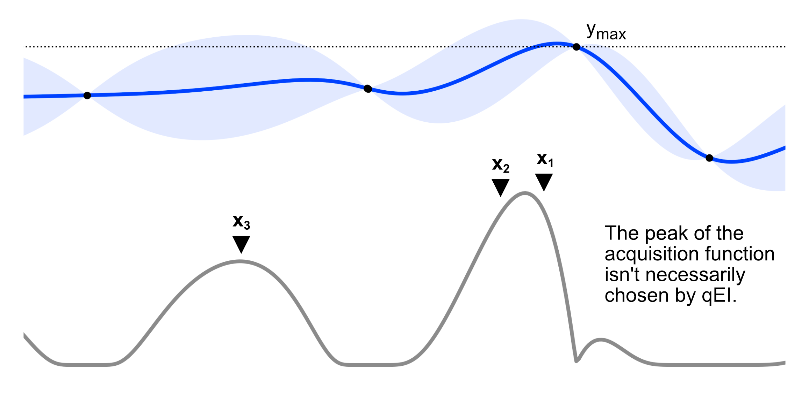

# Single vs. Batch Optimization

Many optimization tasks permit experiments to be run in parallel such that observations for several parameter combinations can be collected within one iteration. For example, microplate arrays allow chemists to analyze tens to hundreds of potential compositions simultaneously. In such scenarios, it is desirable to retrieve several potential experimental designs at each optimization iteration to increase resource efficiency. In sequential optimization, the next experiment is simply the maximum of the acquisition function. However, identifying multiple candidates that are likely to be optimal for batch optimization is more challenging both conceptually and computationally. Consider the gaussian process model and calculated acquisition function (expected improvement) in the figure below. After selecting the most optimal acquisition function value $x_1$, the choice of a second point, $x_2$, to test isn't immediately obvious. Testing a point near the first may produce a similarly good value, but it is unlikely to provide useful information that will improve the model. Moving further away may improve the surrogate model, but risks using resources on poor performing candidates.

Ideally, a set of *q* points is selected such that their joint expected improvement is maximized. This is denoted mathematically in the equation below:

$$qEI(X) = E\left[\textrm{max}(\textrm{max}(f(x_1), f(x_2),..., f(x_q)) - f(x^*), 0)\right]$$

Finding the optimal joint expected improvement is computationally difficult and typically requires the use of Monte Carlo estimation methods. This estimation has become easier through the development of several notable algorithms, and trivial to utilize thanks to the inclusion of efficient versions of these algorithms in state of the art libraries like `Ax` and `Botorch`. That said, a variety alternative approaches have emerged within the literature that are less computationally demanding. These typically rely on "*fantasy models*," which utilize simulated outcomes derived from the current surrogate model predictions to preemptively update and refine the model at each selection of a batch point. Put another way, for each requested point in the batch, the model assumes an observation value at the optimal acquisition function value and refits the model before selecting the next point. Common assumption strategies include the 'Kriging believer,' which takes an optimistic view by assuming the function's mean at the point of interest, and the 'constant liar,' which assumes values pessimistically to safeguard against overestimation in pursuit of the optimization goal. Other approaches propose seeking iteratively lower modes of the acquisition function, penalize the acquisition function near already observed points, or maximize exploration beyond the optimal point. While more computationally efficient, these approaches show weaker empirical performance relative to joint expected improvement estimation.

In estimating the optimal joint expected improvement for three points in function shown at the start of this article, the following points would have been sampled.

This is both sensical and likely what many practitioners would apply under naive assumptions as well. However, it is worth noting that batch optimization approaches can, at times, behave in unexpected ways due to implicit penalties in the computation of joint expected improvement. Consider the batch point selection for the function below. The chosen points $x_1$ and $x_2$ lie to either side of the sharp acquisition function peak rather than at the center, which reflects a balance between the maximum value and the maximum joint probability. Thus, in batch optimization, the optimal acquisition function value won't always be selected.

## Which approach is right for your problem?

For tasks that allow experiments to be performed in parallel, batch optimization is generally preferred as it is more time and resource efficient compared with sequential optimization. That said, in the absence of per-observation model updates, it is likely some batch points will show relatively poor objective function performance. Poor performing observations may, however, improve model representation, resulting in better subsequent predictions. Sequential optimization allows the model to be updated with each observation, which potentially allows greater per trial improvement in model predictions. These advantages and disadvantages are often situation dependent, and the parallelizability of a given task is often a better selection criteria for single vs. batch optimization.
