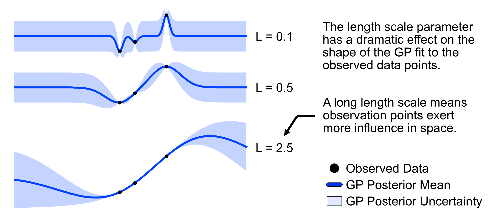
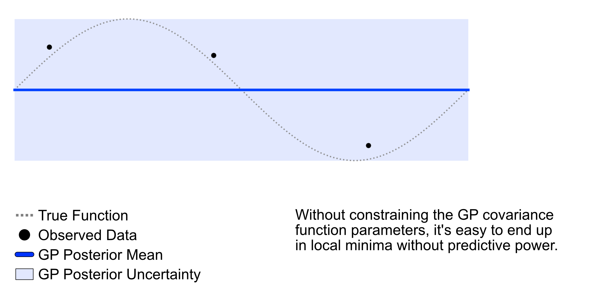
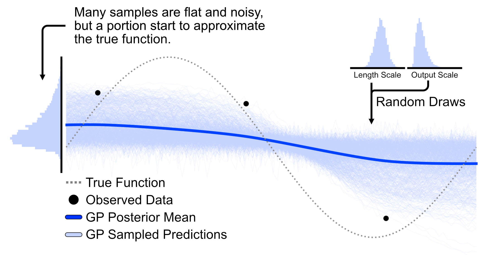
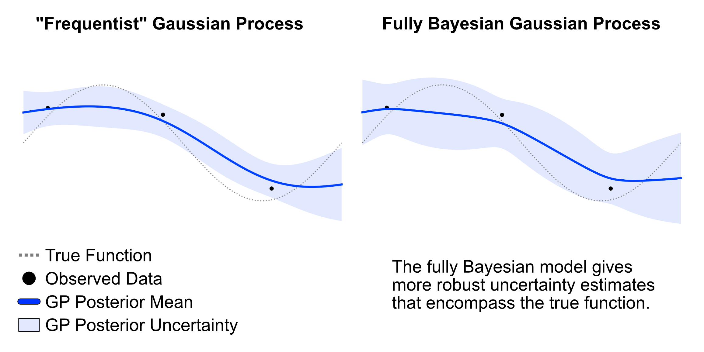

# Frequentist Vs. Fully Bayesian Gaussian Process Models

A distinction is sometimes made between "frequentist" and "fully Bayesian" gaussian process (GP) surrogate models. As GPs are often thrown under the Bayesian model umbrella, this distinction can be confusing to users who don't have a strong background in probabilistic modeling. In this write up, we hope to clarify the difference and provide some helpful recommendations of when to choose one over the other.

## Gaussian Process Parameters
In the interest of brevity, it is assumed that the reader is generally familiar with gaussian process models and their properties. If you are new to GPs, consider watching this excellent [lecture](https://www.youtube.com/watch?v=92-98SYOdlY) on the intuition and mathematics behind them before reading onward.

At their simplest, GPs are defined by a mean and a covariance function. The mean function represents the average behavior of the process across different input points, serving as a baseline trend in the absence of observed data. The covariance function (sometimes called the kernel) defines the relationships between observed data points and is controlled by set of parameters. Common covariance functions, such as the radial basis function (RBF), are defined by `length scale` and `output scale` parameters. These parameters have a strong impact on the shape and fit of the GP to the data. The effects of the `length scale` parameter on GP behavior is shown in the figure below where its impact can be clearly seen.

Fitting a GP to a set of datapoints involves estimating the values of these parameters such that a fitting error is minimized. It is at this point where the distinction between frequentist and fully bayesian methods comes into play.

## Frequentist GP Fitting

The "frequentist" approach aims to provide point estimates for the parameters of the covariance function using *maximum a posteriori* (MAP) estimation. In practice, this results in a single estimate of the `length scale` and `output scale` parameters that are found to minimize model error given the data. This is the most common estimation scheme for GP models and is the default for many GP libraries.

While MAP estimation works well in general scenarios, single point estimates of covariance function parameters can lead to unintended results when few data points are observed and constraints on the values of GP parameters are too loose. Consider the figure below where a GP is initialized with default parameters in the `botorch` library and fit to the data. We see that although the GP captures the spread of the data points (minimizes model error) it has little predictive strength.

In our toy example above, this error is easy to see and remedy. However, in higher dimensional space, fitting errors like this might be harder to diagnose. A completely flat data representation has consequences for optimization tasks and makes sequential point selection less efficient. Thus, care should be taken when specifying GP parameters and evaluating predictions in limited data scenarios.

## Fully Bayesian GP Fitting

By contrast, a fully Bayesian GP treats the covariance function parameters as distributions rather than single point values and tries of find a likely distribution from which those parameters are drawn. At an abstract level, the estimation procedure follows the familiar Bayes' rule, where the posterior is proportional to a prior multiplied by the likelihood. In practice, the posterior distributions are challenging to compute directly, so estimation methods such as Markov Chain Monte Carlo (MCMC) are used. The details of which are beyond the scope of this article.

Given distributions of covariance function parameters, we can generate potential GP models by sampling parameter values and fitting GPs to the data with them. By then averaging over these potential GPs we can obtain a mean posterior prediction. A graphical representation of this process is shown in the figure below. The predictions of GPs with different parameters drawn from the distribution are shown in light blue, with the dark blue showing the mean.

Notice that although many of the sampled predictions are similar to the "frequentist" GP fit, the distribution gives some weight towards parameters that are closer to the true function, which leads to a non-constant GP mean that provides an improvement in predictive performance.

In this way, fully Bayesian GPs tend to offer more robust estimations of model uncertainty.

## Which GP is Right For Your Problem

Looking at the above results, it might be tempting to choose the fully Bayesian GP every time. However, it's worth noting that the fully Bayesian approach comes with the downside of a higher computational cost in fitting and computing the next observation point. For online systems, this can result in a significant amount of computing resources being devoted to the optimizer which may reduce optimization efficiency and increase cost. Additionally, the GPs fit in the above examples made minimal assumptions about the problem and did not impose any hard constraints on covariance function parameters. If instead we place some reasonable bounds on our `lengthscale` and our data's `noise` parameters, we see that both fitting methods produce similar looking mean functions that are comparable in performance on an optimization task.

In the above examples it should be clear that the key advantage of going fully Bayesian is that it can provide more robust models when knowledge about the domain is extremely limited, data is scarce relative to the number of input dimensions, and observation noise is difficult to measure. For many problems, a standard "frequentist" GP will give equivalent optimization performance and should be the default unless a fully Bayesian approach can be justified.

## Additional Resources

ML Tutorial: Gaussian Processes (Richard Turner)
- https://www.youtube.com/watch?v=92-98SYOdlY

High-Dimensional Bayesian Optimization with SAASBO
- https://ax.dev/tutorials/saasbo.html
